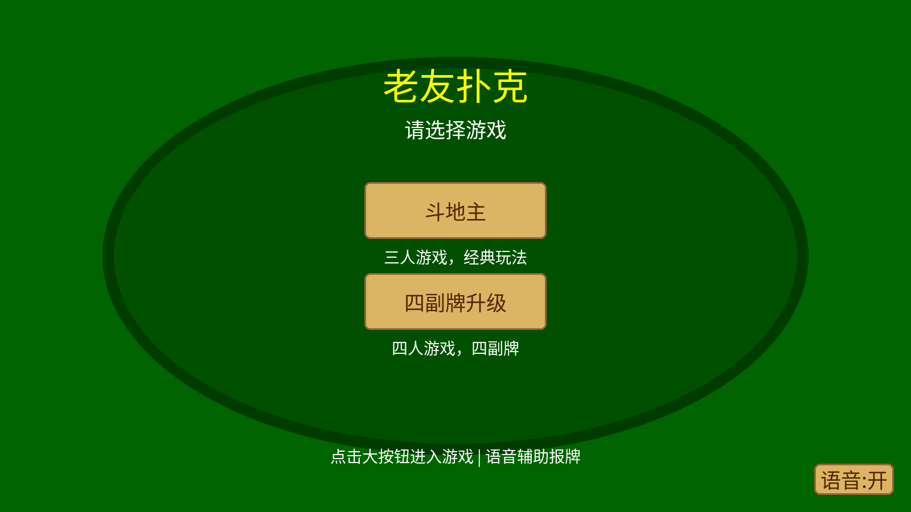
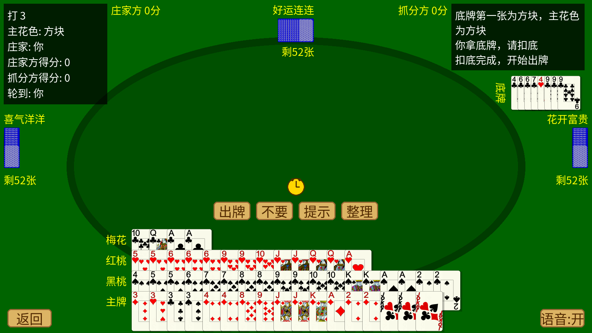

# 老友扑克（ Elder Poker ）

> [English README](README_EN.md)

**为奶奶开发的纸牌游戏。**

我奶奶喜欢玩赣州同城游里的"四副牌升级"，玩了很多年。后来那个平台把积分和充值挂了钩，她就不玩了。

作为孙子，我给她写了一个属于她自己的版本——没有充值、没有广告、没有积分套路，就是干干净净的打牌。字体够大、有语音播报、出牌慢了会自动帮忙出，在电脑和安卓平板/手机上都能玩。

## 游戏内容

| 游戏 | 说明 |
|---|---|
| 四副牌升级 | 四人四副牌，对家组队，叫主/扣底/拖拉机/抠底完整规则 |
| 斗地主 | 三人经典玩法，三个难度 |

## 为老年人做的设计

- **大字体、大牌面**：高清矢量牌面，角标加粗放大量
- **语音播报**：离线语音包（微软晓晓音色），不依赖手机系统 TTS——出牌、亮主、轮到谁、输赢都有声音
- **30 秒出牌倒计时**：超时自动帮忙打出最优的牌，不慌不急；AI 对手的闹钟也显示秒数，像在认真想牌
- **看不清的全改掉**：得分牌两行展示、扣底进度提示、每轮结束停留 2.5 秒看清再收牌
- **无充值、无积分、无广告、无需联网**

## 安装（安卓平板/手机）

1. 去 [Releases](https://github.com/leonadojim/elderpoker/releases) 下载最新 APK
2. 拷到平板/手机上点击安装（会提示"未知来源"，允许即可）
3. 要求：64 位设备（2017 年后的手机平板都支持），横屏

电脑上玩：安装 Python 和 pygame 后运行 `python main.py`。

## 技术栈

- Python + pygame 2.6.1
- 安卓打包：python-for-android / buildozer（GitHub Actions 云端编译）
- 每次推送自动编译 APK，并在云端安卓模拟器里自动启动、截图、验证不闪退
- 踩坑实录见 [docs/安卓APK打包排错手册.md](docs/安卓APK打包排错手册.md)（20 轮编译失败总结，给后来人借鉴）

## 截图

| 游戏大厅 | 四副牌升级对局 |
|---|---|
|  |  |

## License

代码 MIT License。牌面素材来自 [SVGCards](https://github.com/saulspatz/SVGCards)（public domain），语音由 Microsoft edge-tts 生成，中文字体为思源黑体（OFL）。

---

*写给奶奶：慢慢打，不着急，打错了还有提示。*
